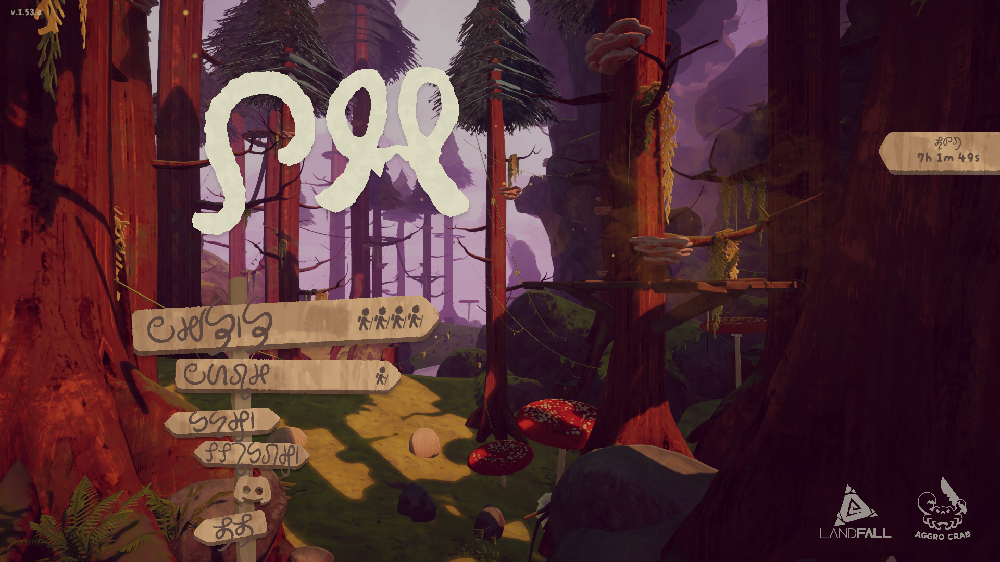

# PEAK Neptunian Localization

Localizes PEAK into Neptunian from Dimension 66A.

#### Progress: ~45.66%

## License

### `assets/`

<a href="https://github.com/Beyley/PeakNeptunian">PEAK Neptunian Localization</a> © 2025 by Beyley Cardellio (Textures) + Zurui the Scrunkler (Bing Bong Voice Lines) is licensed under <a href="https://creativecommons.org/licenses/by-nc-sa/4.0/">CC BY-NC-SA 4.0</a>

### Everything Else

GPLv2.0-only, see `LICENSE`

## Special Thanks

- Zurui the Scrunkler for voicing PING PANG
- ZeWei for Neptunian itself, the Neptunian Shpre font, Laghari Portals, and providing assistance with translations
- Pahbedeng phre for playtesting my silly machenations
